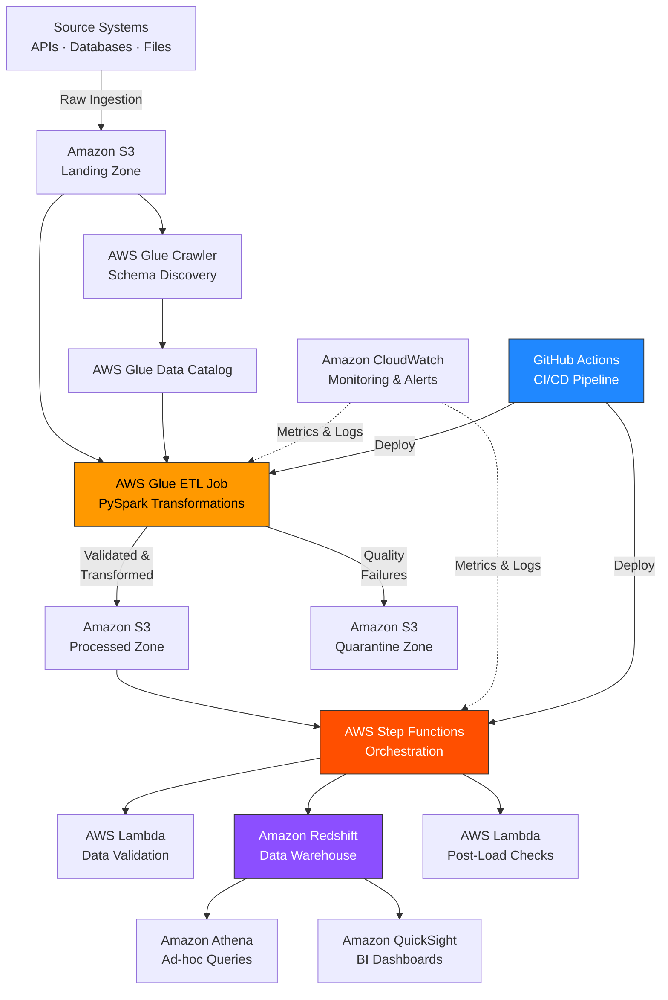

# AWS Data Pipeline Platform


> **Production-grade AWS data pipeline delivering 83% processing improvement** — automated ETL orchestration using AWS Glue, Lambda, Step Functions, and Redshift with CI/CD-driven deployments and real-time alerting.

---

## 📐 Architecture



---

## 🎯 Problem Statement

Ad-hoc data workflows were manually triggered, took 50+ minutes to complete, and had no error recovery — a single upstream schema change would silently corrupt downstream reporting tables. Deployments were manual and untested, causing frequent production incidents.

## ✅ Solution

A configuration-driven, fully orchestrated AWS data pipeline with automated schema discovery, multi-stage PySpark transformation, quarantine-based error handling, and GitHub Actions CI/CD — reducing processing time by **83%** and delivering **$50K in annual infrastructure cost savings** through intelligent Glue worker management.

---

## 📊 Key Metrics

| Metric | Before | After | Improvement |
|---|---|---|---|
| ETL processing time | 50+ minutes | ~6 minutes | **83% faster** |
| Manual interventions | ~15/week | ~3/week | **80% reduction** |
| Annual infrastructure cost | Baseline | −$50,000 | **$50K savings** |
| Pipeline availability | ~95% | 99.9% | Production-grade |
| Deployment time | Manual (~2 hrs) | Automated (~8 min) | **93% faster** |

---

## 🛠️ Tech Stack

| Layer | Technology |
|---|---|
| Ingestion | AWS Glue Crawler, S3 Landing Zone |
| Transformation | AWS Glue ETL (PySpark), Glue Data Catalog |
| Orchestration | AWS Step Functions, AWS Lambda |
| Storage | Amazon S3 (Landing / Processed / Quarantine) |
| Warehouse | Amazon Redshift Serverless |
| Query | Amazon Athena |
| Visualisation | Amazon QuickSight |
| Monitoring | Amazon CloudWatch, SNS Alerts |
| CI/CD | GitHub Actions |
| IaC | AWS CloudFormation |

---

## 📁 Project Structure

```
AWS-Data-Pipeline-Platform/
├── glue/
│   ├── jobs/
│   │   ├── ingestion_job.py          # Raw ingestion → S3 Landing
│   │   ├── transformation_job.py     # PySpark ETL transforms
│   │   └── validation_job.py         # Data quality checks
│   └── scripts/
│       └── deploy_glue_jobs.sh
├── step_functions/
│   ├── pipeline_definition.json      # Step Functions state machine
│   └── error_handling.json           # Retry + catch logic
├── lambda/
│   ├── data_validator/
│   │   └── handler.py                # Post-load validation Lambda
│   └── alerting/
│       └── handler.py                # CloudWatch → SNS alert Lambda
├── redshift/
│   ├── ddl/
│   │   ├── fact_tables.sql
│   │   └── dimension_tables.sql
│   └── stored_procedures/
│       └── post_load_checks.sql
├── infra/
│   └── cloudformation/
│       ├── pipeline_stack.yaml       # Core infrastructure stack
│       └── monitoring_stack.yaml     # CloudWatch dashboards & alarms
├── config/
│   ├── pipeline_config.yaml          # Environment-specific config
│   └── field_mappings.json           # Source-to-target mappings
├── tests/
│   ├── test_transformations.py
│   ├── test_validation.py
│   └── test_step_functions.py
├── .github/
│   └── workflows/
│       ├── ci.yml                    # Test & lint on PR
│       └── deploy.yml                # Deploy to AWS on merge to main
└── README.md
```

---

## ⚙️ Key Engineering Decisions

- **Glue worker auto-scaling** — dynamic worker allocation based on input size reduces idle capacity costs; primary driver of $50K annual saving.
- **Step Functions for orchestration over Airflow** — native AWS integration with Lambda and Glue eliminates the operational overhead of managing an Airflow cluster for this scale.
- **Quarantine zone pattern** — failed records are routed to a separate S3 prefix with full lineage metadata, enabling replay without re-running full pipeline.
- **Config-driven field mappings** — source-to-target transformations stored in JSON config so schema changes are handled without code changes.

---

## 🚀 Quick Start

```bash
# Clone the repo
git clone https://github.com/jesseantony/AWS-Data-Pipeline-Platform.git
cd AWS-Data-Pipeline-Platform

# Deploy infrastructure
aws cloudformation deploy \
  --template-file infra/cloudformation/pipeline_stack.yaml \
  --stack-name aws-data-pipeline \
  --capabilities CAPABILITY_IAM

# Deploy Glue jobs
bash glue/scripts/deploy_glue_jobs.sh --env dev

# Run tests
pip install -r requirements.txt
pytest tests/ -v
```

---

## 📌 Topics

`aws` `aws-glue` `pyspark` `step-functions` `lambda` `redshift` `s3` `data-engineering` `etl` `python` `cloudformation` `github-actions`
